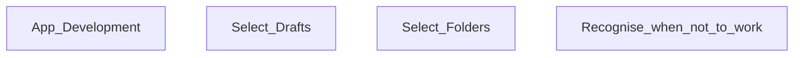

# Main Goal

My plan is to make a set of notes that are interlinked, especially when it comes to mathematical problem solving techniques. To be honest, I am a little unsure of what I need to do this so I am just going to experiment while trying to move forward. 

## Intermediate goals

- Create a set of draft notes that compile to the real notes in different ways. Check that we have a metadata file. We can use this to shorten the amount of checks that the file will have to go through. 
- Create an app to help with the compiling of notes.

## App Development

## Crafting narrative

Techniques will be used to create narrative among the proofs. I am wondering if I can provide a broad scope of this book by talking about the purpose of each section. Think further on this.