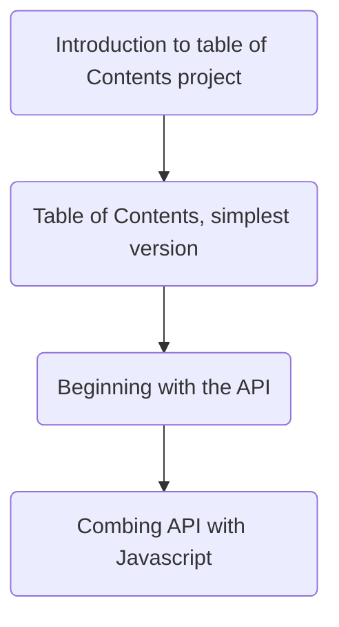

# Script Goals

Got This!

| Animation Task                                                                                                                                                                    | Status      | Due Date   |
| --------------------------------------------------------------------------------------------------------------------------------------------------------------------------------- | ----------- | ---------- |
| [[Obsidian Scripts/Week 1/Tasks/NotFinished/Create sketchs for Introduction to table of Contents project.md\|Create sketchs for Introduction to table of Contents project]]       | Not Started | 12-02-2024 |
| [[Obsidian Scripts/Week 1/Tasks/NotFinished/Create Animations for Table of Contents, simplest version.md\|Create Animations for Table of Contents, simplest version]]             | Not Started | 12-09-2024 |
| [[Obsidian Scripts/Week 1/Tasks/NotFinished/Create Animations for Introduction to table of Contents project.md\|Create Animations for Introduction to table of Contents project]] | Not Started | 12-02-2024 |
| [[Obsidian Scripts/Week 1/Tasks/NotFinished/Create Animations for Combing API with Javascript.md\|Create Animations for Combing API with Javascript]]                             | Not Started | 12-09-2024 |
| [[Obsidian Scripts/Week 1/Tasks/NotFinished/Create Animations for Beginning with the API.md\|Create Animations for Beginning with the API]]                                       | Not Started | 12-09-2024 |

| Editing Task                                                                                                                                                | Status      | Due Date   |
| ----------------------------------------------------------------------------------------------------------------------------------------------------------- | ----------- | ---------- |
| [[Obsidian Scripts/Week 1/Tasks/NotFinished/Edit Table of Contents, simplest version Video.md\|Edit Table of Contents, simplest version Video]]             | Not Started | 12-09-2024 |
| [[Obsidian Scripts/Week 1/Tasks/NotFinished/Edit Introduction to table of Contents project Video.md\|Edit Introduction to table of Contents project Video]] | Not Started | 12-02-2024 |
| [[Obsidian Scripts/Week 1/Tasks/NotFinished/Edit Combing API with Javascript Video.md\|Edit Combing API with Javascript Video]]                             | Not Started | 12-09-2024 |
| [[Obsidian Scripts/Week 1/Tasks/NotFinished/Edit Beginning with the API Video.md\|Edit Beginning with the API Video]]                                       | Not Started | 12-09-2024 |

| Recording Task                                                                                                                                                        | Status      | Due Date   |
| --------------------------------------------------------------------------------------------------------------------------------------------------------------------- | ----------- | ---------- |
| [[Obsidian Scripts/Week 1/Tasks/NotFinished/Record Table of Contents, simplest version Video.md.md\|Record Table of Contents, simplest version Video.md]]             | Not Started | 12-09-2024 |
| [[Obsidian Scripts/Week 1/Tasks/NotFinished/Record Introduction to table of Contents project Video.md.md\|Record Introduction to table of Contents project Video.md]] | Not Started | 12-02-2024 |
| [[Obsidian Scripts/Week 1/Tasks/NotFinished/Record Combing API with Javascript Video.md.md\|Record Combing API with Javascript Video.md]]                             | Not Started | 12-09-2024 |
| [[Obsidian Scripts/Week 1/Tasks/NotFinished/Record Beginning with the API Video.md.md\|Record Beginning with the API Video.md]]                                       | Not Started | 12-09-2024 |

| Script Task                                                                                                                                                             | Status      | Due Date   |
| ----------------------------------------------------------------------------------------------------------------------------------------------------------------------- | ----------- | ---------- |
| [[Obsidian Scripts/Week 1/Tasks/NotFinished/Write script for Table of Contents, simplest version.md\|Write script for Table of Contents, simplest version]]             | Not Started | 12-09-2024 |
| [[Obsidian Scripts/Week 1/Tasks/NotFinished/Write script for Introduction to table of Contents project.md\|Write script for Introduction to table of Contents project]] | Not Started | 12-02-2024 |
| [[Obsidian Scripts/Week 1/Tasks/NotFinished/Write script for Combing API with Javascript.md\|Write script for Combing API with Javascript]]                             | Not Started | 12-09-2024 |
| [[Obsidian Scripts/Week 1/Tasks/NotFinished/Write script for Beginning with the API.md\|Write script for Beginning with the API]]                                       | Not Started | 12-09-2024 |

| Sketch Task                                                                                                                                                     | Status      | Due Date   |
| --------------------------------------------------------------------------------------------------------------------------------------------------------------- | ----------- | ---------- |
| [[Obsidian Scripts/Week 1/Tasks/NotFinished/Create sketchs for Table of Contents, simplest version.md\|Create sketchs for Table of Contents, simplest version]] | Not Started | 12-09-2024 |
| [[Obsidian Scripts/Week 1/Tasks/NotFinished/Create sketchs for Combing API with Javascript.md\|Create sketchs for Combing API with Javascript]]                 | Not Started | 12-09-2024 |
| [[Obsidian Scripts/Week 1/Tasks/NotFinished/Create sketchs for Beginning with the API.md\|Create sketchs for Beginning with the API]]                           | Not Started | 12-09-2024 |

| Finished-Task | Status | Task-Type |
| ------------- | ------ | --------- |

# Final Draft

The script: [[Introduction to table of Contents project(Obsidian)]] is incomplete.
The script: [[Table of Contents, simplest version(Obsidian)]] is incomplete.
The script: [[Beginning with the API(Obsidian)]] is incomplete.
The script: [[Combing API with Javascript(Obsidian)]] is incomplete.

# Current Thoughts

Test

