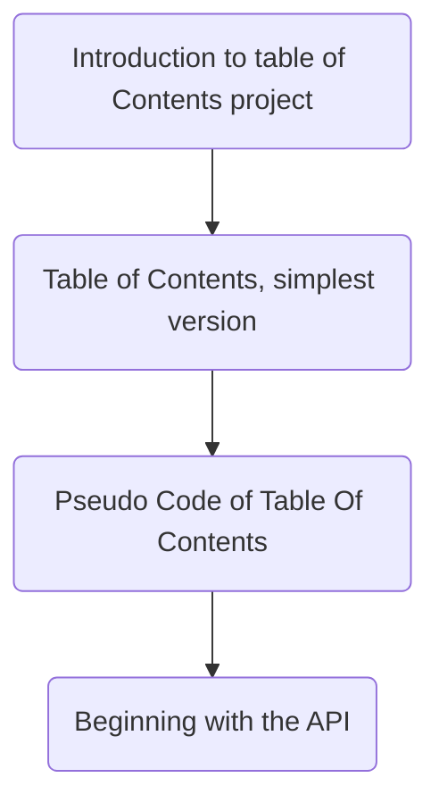

# Script Goals

## Building an obsidian community plugin

The goal for this script is to build the start of a community plugin for Obsidian. The purpose of this plugin is to build a table of contents in such a way that allows for the table of contents to be updated and compatible with obsidian publish.

## Trying out a different style of video

In my last two videos, I tried different styles. For my first video I tried having relevant screenshots on the screen that I talked over. For my second video, I created some animations to talk over. My third video is going to combine these two aspects and allow for 

| Animation Task                                                                                                                                                                    | Status      | Due Date   |
| --------------------------------------------------------------------------------------------------------------------------------------------------------------------------------- | ----------- | ---------- |
| [[Obsidian Scripts/Week 1/Tasks/NotFinished/Create Animations for Table of Contents, simplest version.md\|Create Animations for Table of Contents, simplest version]]             | Not Started | 12-09-2024 |
| [[Obsidian Scripts/Week 1/Tasks/NotFinished/Create Animations for Pseudo Code of Table Of Contents.md\|Create Animations for Pseudo Code of Table Of Contents]]                   | Not Started | 12-09-2024 |
| [[Obsidian Scripts/Week 1/Tasks/NotFinished/Create Animations for Introduction to table of Contents project.md\|Create Animations for Introduction to table of Contents project]] | Not Started | 12-02-2024 |
| [[Obsidian Scripts/Week 1/Tasks/NotFinished/Create Animations for Beginning with the API.md\|Create Animations for Beginning with the API]]                                       | Not Started | 12-09-2024 |

| Editing Task                                                                                                                                                | Status      | Due Date   |
| ----------------------------------------------------------------------------------------------------------------------------------------------------------- | ----------- | ---------- |
| [[Obsidian Scripts/Week 1/Tasks/NotFinished/Edit Table of Contents, simplest version Video.md\|Edit Table of Contents, simplest version Video]]             | Not Started | 12-09-2024 |
| [[Obsidian Scripts/Week 1/Tasks/NotFinished/Edit Pseudo Code of Table Of Contents Video.md\|Edit Pseudo Code of Table Of Contents Video]]                   | Not Started | 12-09-2024 |
| [[Obsidian Scripts/Week 1/Tasks/NotFinished/Edit Introduction to table of Contents project Video.md\|Edit Introduction to table of Contents project Video]] | Not Started | 12-02-2024 |
| [[Obsidian Scripts/Week 1/Tasks/NotFinished/Edit Beginning with the API Video.md\|Edit Beginning with the API Video]]                                       | Not Started | 12-09-2024 |

| Recording Task                                                                                                                                                        | Status      | Due Date   |
| --------------------------------------------------------------------------------------------------------------------------------------------------------------------- | ----------- | ---------- |
| [[Obsidian Scripts/Week 1/Tasks/NotFinished/Record Table of Contents, simplest version Video.md.md\|Record Table of Contents, simplest version Video.md]]             | Not Started | 12-09-2024 |
| [[Obsidian Scripts/Week 1/Tasks/NotFinished/Record Pseudo Code of Table Of Contents Video.md.md\|Record Pseudo Code of Table Of Contents Video.md]]                   | Not Started | 12-09-2024 |
| [[Obsidian Scripts/Week 1/Tasks/NotFinished/Record Introduction to table of Contents project Video.md.md\|Record Introduction to table of Contents project Video.md]] | Not Started | 12-02-2024 |
| [[Obsidian Scripts/Week 1/Tasks/NotFinished/Record Beginning with the API Video.md.md\|Record Beginning with the API Video.md]]                                       | Not Started | 12-09-2024 |

| Script Task                                                                                                                                                             | Status          | Due Date   |
| ----------------------------------------------------------------------------------------------------------------------------------------------------------------------- | --------------- | ---------- |
| [[Obsidian Scripts/Week 1/Tasks/NotFinished/Write script for Table of Contents, simplest version.md\|Write script for Table of Contents, simplest version]]             | Not Started     | 12-09-2024 |
| [[Obsidian Scripts/Week 1/Tasks/NotFinished/Write script for Pseudo Code of Table Of Contents.md\|Write script for Pseudo Code of Table Of Contents]]                   | Not Started     | 12-09-2024 |
| [[Obsidian Scripts/Week 1/Tasks/NotFinished/Write script for Introduction to table of Contents project.md\|Write script for Introduction to table of Contents project]] | Making Progress | 12-02-2024 |
| [[Obsidian Scripts/Week 1/Tasks/NotFinished/Write script for Beginning with the API.md\|Write script for Beginning with the API]]                                       | Not Started     | 12-09-2024 |

| Sketch Task                                                                                                                                                                 | Status      | Due Date   |
| --------------------------------------------------------------------------------------------------------------------------------------------------------------------------- | ----------- | ---------- |
| [[Obsidian Scripts/Week 1/Tasks/NotFinished/Create sketchs for Pseudo Code of Table Of Contents.md\|Create sketchs for Pseudo Code of Table Of Contents]]                   | Not Started | 12-09-2024 |
| [[Obsidian Scripts/Week 1/Tasks/NotFinished/Create sketchs for Introduction to table of Contents project.md\|Create sketchs for Introduction to table of Contents project]] | Not Started | 12-02-2024 |
| [[Obsidian Scripts/Week 1/Tasks/NotFinished/Create sketchs for Beginning with the API.md\|Create sketchs for Beginning with the API]]                                       | Not Started | 12-09-2024 |

| Finished-Task                                                                                                                                                | Status | Task-Type |
| ------------------------------------------------------------------------------------------------------------------------------------------------------------ | ------ | --------- |
| [[Obsidian Scripts/Week 1/Tasks/Complete/Create sketchs for Table of Contents, simplest version.md\|Create sketchs for Table of Contents, simplest version]] | Done   | Sketch    |

# Final Draft

Hi everyone. This project is to create a plugin for Obsidian. The plugin will create table of contents for files based on the headings. This desire starts from two causes, starting with experiencing all the plugins that obsidian has to offer. There are plugins such as metaData menu and the home plugin that I use everyday. I would like to contribute to this community if possible. It could also be good experience to build a program myself. I chose to make a plugin that makes a table of contents as I think this could be useful. There are two popular plugins that do this already but both are missing some functionality that I would like. The most popular one allows you to build a table of contents anywhere but it does not update as the file updates. As my file changes I still want the ability for the table of contents to change. The second one updates your notes but does it not work with obsidian publish. As I am posting my notes online, this does not work for me.

My goal is to start small to get a working model. I intend to add more features as the model works. Obsidian uses JavaScript so, before using the touching the application program interface of Obsidian, I will build a JavaScript function in my vault. To simplify further, I will not have the table of contents updatable to start and the table of contents will be positioned at the start of the note. We will also assume some structure to the file. Edge cases can be dealt with later. When this is done I will integrate it with the application program interface protocols of Obsidian. By the end of this video I aim to have a working model in place!.

We will start by examining the structure of a markdown file. It consists of the frontmatter and the contents of the file. We need to split the frontmatter from the content of the file. The table of contents only applies to the content of the file. We store the frontmatter for later. We also make a function, toc, that takes the content in to generate the table of contents. The final step will be recreating the file. We start with the frontmatter, which is then followed by the table of contents. Then the content of the file is added back in.

Now lets examine how the table of contents is generated in more detail. Markdown files can have headings and multiple different subheadings. The subheadings will need to be nested beneath their respective headings correctly. There could be subheadings of subheadings. We will deal with those later to simplify the task. Let's start talking about how to build our table of contents. We need to plan how to convert a markdown file into the data we need.

To start we want the main headings to be numbered in order. Subheadings should also be numbered in order. The order should restart under each new section. This means we should "forget" the numbering system as we move to new sections. This indicates that we want a function to be applied to each heading. From there we can figure out data about the subheadings. Structurally, we want to separate the text into its headings. From there we can create subheadings as they are needed. Note that the number of hashtags changes as we get more subheadings.

To simplify we will talk about how the code operates. Later we can preoceed systematically through the details of what is happening. To begin we want our code to take in a file. This file contains the frontmatter and the content of the file. The content is what we create the table of contents from so we separate out the content from the frontmatter. Then we focus on creating the table of contents from the content. From these three pieces we create out new file. We combine them all together. Lets examine this in more detail. We will start with the function that separates the frontmatter from the content. I will refer to this as the split function.

The split function takes a markdown file and returns its frontmatter and contents. To create it we need to examine the structure of a markdown file. Not all markdown files will have frontmatter. If it does, the file will start off with three minus signs. If this is not there, there is no frontmatter and the entire file is content. In this situation we return an empty string as the frontmatter and the file as the content. If the file does start off with three empty strings we need to know where the frontmatter ends. It ends with the second instance of three minus signs. If the file does not have a second instance, an error has occurred (in my model.). We could use the method index of to find the three minus signs but that will only give us the first instance of this. To find the second instance we need some other indicator. Note that the second instance will occur after a line break. Therefore we can use the index of method on a return character followed by three minus signs to find the second instance. We denote this index as endFront. The frontmatter can be found using the slice operator on the file. The frontmatter should go from 0 to endFront. The content is the rest of the file so it should range from endFront to the length of the file. Now we will focus on how to turn the content into the table of contents.

We split the content based off of the hastags that indicate the main headings. The first heading may have a character return after it or not. The rest of them won't. From here we split each section's content into lines. We then remove any lines that are empty. The first line is the title that will be in our heading. From here we need to account for the subheadings in our section. This will be accounted for within the content.

Now that I have a rough idea for a plugin I need to build it. This means getting code up and running and working with the API system in Obsidian. To do this I decided to see how other people had done this. I found a youtuber,  Florian Ludewig, who has an amazing video on how to build a community plugin. He proceed through common pitfalls of building a plugin. He does this while showing multiple methods that are useful in building the plugin. The video is linked below. Obsidian give you a sample plugin to build your idea. All you need to do is fork it on Github.

Obsidian plugins are build in Typescript. I had used JavaScript before but the transition to Typescript was not too difficult for this.

## Sources

Florian Ludewig: https://www.youtube.com/watch?v=AgXa03ZxJ88&t=918s
Sample Plugin: https://github.com/obsidianmd/obsidian-sample-plugin
Obsidian Developer Docs: https://docs.obsidian.md/Home

# Current Thoughts

## Community Plugins

Topic: Trying to contribute back
- Obsidians plugins are class.
- It'd be nice to give back. 
- Its crazy that these are not just available but also free.

## Building a Project
Topic: Random side tangents
- Not knowing what you need.
- Avoiding premature optimisation.
- Avoiding zero optimisation.

## Graphing the project
Topic: Utilising mermaid Diagrams.
- Task management is super important.
- Need a way to segment the process.
- Mermaid diagrams are super useful in showing how to breakup a task.

