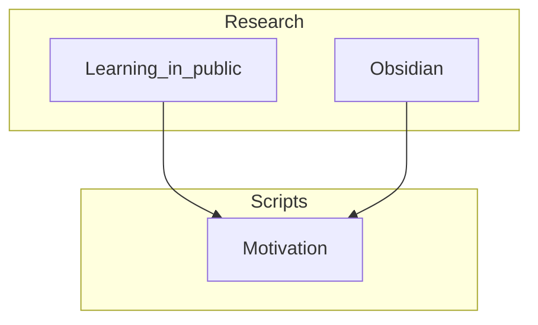

# Script Goals

Goal for this week is to get a video out and talk about things I find interesting.

## Picture overview

| Finished-Task                  | Status | Task-Type |
| ------------------------------ | ------ | --------- |
| Write Motivation Script        | Done   | Script    |
| Write first script about Rustc | Done   | Script    |
| Write first script about Cargo | Done   | Script    |
| Write about guessing game      | Done   | Script    |
| Record Week 1 Scripts          | Done   | Recording |
| Edit Video for Week 1          | Done   | Editing   |

# Final Draft

Hi all! Welcome to my YouTube Channel. This channel is going to be about trying to learn new things publicly, beginning with Rust! To start my YouTube channel, I knew it was going to be about learning skills, but I was unsure of how to proceed in doing this. To gather inspiration, I began looking at how other people do this. I found an amazing creator, Nicole Van Der Hoeven, who publishes content about obsidian, a note organising app, online. Furthermore, she demonstrated a concept called learning in public with a website. (I've seen a few variations of this definition) This website is build using a tool called obsidian publish.  Here, you can build a set of notes that can try to explain concepts and help others (and me!) understand. This is what is currently on the screen and a link will be available below. Furthermore it allows people to deeply question what you think you know. A personal issue I have with this is that it requires a lot of writing, a weak point of mine.  I should fix this, even without this channel. This issue is not unique so I searched for people who have strategies to tackle this. When I tried to search for how YouTube creators did this, I often found a process and and clean edited final product with no steps in between. I decided that as I wanted to improve my writing, I would display the processes I've taken with writing scripts alongside the material I am learning in Rust.   

 I found a YouTube channel, Python programmer, discussing a writing system by Dr. Jordan Peterson.

 To start learning Rust, I decided to follow common strategies people use to do so. This led me to the Rust website and the Rust book. The book is a starting place but there seems to be quite a few avenues you can branch off from from there. I think I am going to look at web development as I have previously made a website with Django and I have a new idea for a website.  One thing to consider is that I don't understand Rust so I will wait until I know more before fully committing to that decision. While proceeding through this book, I am going to try make connections between Rust and other languages that I know small parts of. I have heard making connections between different languages can be useful in learning.

The simplest method you can use to compile a rust file is to use rustc on a rust file. Doing so creates an executable you can run.You can see this in other languages such as Java that have javac to compile a file.This is not used too often as there is inbuilt support of creating rust programs through a tool called cargo. We will discuss this tool shortly. To start we will create a "hello world" file in Rust using rustc.
To start, we will focus on what needs to be in a rust file for it to compile. The rust compiler looks for a main function. Which is also seen in java. Then the main behaviour of the function is captured between the parentheses. We can output the phrase we want using a macro println!. This initially seemed to act like a function with a exclamation point attached. To try understand this more, I decided to use the Rust documentation and saw there were quite a few uses for it. There seemed to be a lot of building blocks to make macros so I decided to focus on proceeding through the book first. To print hello world, we use the macro println!, making sure to end the sentence with a semi-colon.

(My section on TOML is wrong. I am realising I don't actually know it. So I am just going to admit that)

In practice, cargo is used instead of rustc to make code. Cargo allows you to manage other libraries and packages in your code efficiently. We can create a project with cargo by typing cargo project name and it will automatically make a folder of that name with files in it. The libraries that we can use will be held within a TOML folder. Let's dig into TOML by looking at the documentation.

TOML is an abbreviation for Tom's obvious markdown language. To talk about the libraries you want to use, you have a title with square parentheses. You can talk about subfolders of this library by having the title dot followed by the subfolder. This convention is used in other places such as Python. These conditions are automatically enforced by cargo when the program is built.  Also, you have the advantage of selecting which version of a library you want. This is important as if there is an update to a library you are using and it causes your program to no longer work, you can downgrade. To do this, you specify which version of the library you want to use in your TOML file. To build the project, type cargo build into the terminal. One problem that could arise is that building your project each time to check for errors could be extremely time consuming. To combat this, cargo has a check command.  This runs tests on your code to see if it will compile but does not compile it itself. There's probably a lot more to TOML but we will go back to Rust now. To see cargo in action, let's build our first project!

Programming is learned by programming problems. We will create a game where the user has to guess a secret number. This will involve taking a players input and responding based off its relation to the answer. This will help build skills such as identifying data types and making decisions based off how things could occur. We will also learn to deal with errors in our code.  We will use Cargo, highlighted how TOML is used in it. I am also going to try build diagrams of the algorithm as seen on the screen.

 Using cargo to build our project will create a TOML file automatically. This will hold the necessary dependencies our program needs. We can play with testing different versions of the libraries with our code. We can move back a few versions as shown, or even forwards like so. If we go too far, it will cause an error. It also tells us we can beta test a version of a library which I thought was interesting.

Let's start strong by beginning with best practices. I have seen people use diagrams to explain their problems so I will do the same. Here is the diagram for our game. We create a secret number. The player guesses the secret number. If the answer is incorrect, the player is then informed if it is too high or too low. Then they guess again.This repeats until they win and the game closes out after congratulating them. Let's build this!

We start by creating a secret number.  We need a library to do this. The library that works for this is rand.  We import a library by using the use keyword followed by the library name. The libraries can have some conditions on them but we have not yet got to discussing that in this project. Note that we need to mention any library we use in our TOML file. Let's state the version of the library as shown on screen. We can change the version of the library used by changing the version in our TOML file. Note if we try ask for a version that does not exist we will get an error message.

Now we will generate the random number.  We use the let keyword to assign variables. An interesting thing about Rust is that this assumes variables are unchangeable to begin.  Interesting, variables default to being immutable in Rust. Rust also follows the convention of snake case for variables.  The format of snake case is to make the initials lower case and have an underscore between words. We can see secret number in this format. To generate the random number we use the command rand :: thread_rng().gen_range(1..=100). The 1..=100 reminds me of the spread operator in JavaScript.

 We can now take guesses from our player. We don't know how many guesses it will take. Form of control flow that can keep working indefinitely. Rust does have a while statement but this is not used here. I am a bit confused by this as having infinite loops can be dangerous. This may be just an inexperience issue as I am not sure what the Rust strategy for handling loops is. I looked at the documentation and they can label their loops in order to break loops in certain ways (I think). My doubts originate from infinite loops. If I remove the break condition, does this still compile? It does. I am unsure if this is an issue as there are situations where you would like processes to be able to respond indefinitely.

We now want to accept guesses from the player. To make sure we can change our guess if we repeat, we use the mut keyword after let.  If anything goes wrong with retrieving an input, we handle this error with the expect method that prints that string if an error occurs.  Note that Rust puts a point on the mut keyword to let the function know the data is mutable. If the data is immutable, the mut keyword is not there and the ampersand is on the variable itself.  This is to pass references in safely. This will be explained in more depth later. Now we need to extract the number the player gave.

First, we need to ensure we received a number.  If we don't have a number, we let the player guess again. We apply trim to remove spaces. Then we apply parse to see if it is a number. We use pattern matching to solve any errors that occur. For a number, we keep going with our algorithm. If it is not a number we continue onto the next iteration of our loop. I wondered how the code associated num with our input. Is it a placement pattern? To test this, I changed num to a different word and checked to see if the code still worked. As this worked I think it is a placement situation. I will have to investigate this more.

Lastly, we need to compare our guess with the secret answer. We do this with the compare library. We get a .cmp function with a pointer to the variable we want to check. Note that as we do not want to mutate the variable, there is no mut keyword. We pass a reference to our variable by using the ampersand. We have three options to run through. Larger, smaller or equal.  We tell the player whether their guess is too large or small and let them try again. If they are correct, we congratulate them and break out of the loop.

There are aspects of this code I still do not understand. I think I view :: as getting a subfolder of a library but I also know that that it is false. The reason why is that when importing std :: io we still have access to std. Some part of my model is incorrect and I need to fix it. Googling it I found a stack overflow article that says they are path separators. Looking at the documentation I was unsure as they showed many cases and I assume there is some overarching principal here. I see in the rust book that they talk about these in chapter 7 so I am going to postpone till then. One thing I did see in the documentation was about absolute and relative paths. I have seen that before in Django. I don't know if it is related to this but I heard the terminology of RAII (real acquisition is initialization) is in Rust and that it comes from C++.

My next issue is pattern matching in Rust. We can name variables in pattern matching via their placement. This still feels unclear to me. What happens if we have 2 or more variables. Do we ok() and then have a list of names? Do we use keyword assignment? While googling it I found people talking about multiple pattern matching in Stack overflow and they referenced the book. Pattern matching with multiple cases appears in Chapter 18. They did not mention pattern matching with multiple inputs which leads me to think that maybe this just does not happen? I can just experiment for now.

Thanks for joining me on this journey! If ye want to hear more, join the discord below or check out the website where I put all the scripts and tasks. 
