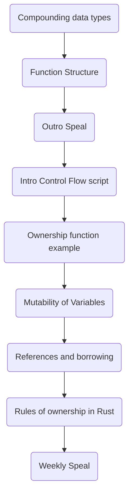

# Script Goals

- Proceed through 3 chapters this week.
- Learn more about editing.
- Utilize algorithmic diagrams more.
- Figure out how to organise sources better.

| Finished-Task                                                                                                                                   | Status | Task-Type |
| ----------------------------------------------------------------------------------------------------------------------------------------------- | ------ | --------- |
| [[Write speal for channel\|Write speal for channel]]                                                 | Done   | Script    |
| [[Write script for Rules of ownership in Rust.md\|Write script for Rules of ownership in Rust.md]]   | Done   | Script    |
| [[Write script for References and borrowing.md\|Write script for References and borrowing.md]]       | Done   | Script    |
| [[Write script for Ownership function example.md\|Write script for Ownership function example.md]]   | Done   | Script    |
| [[Write script for Outro Speal.md\|Write script for Outro Speal.md]]                                 | Done   | Script    |
| [[Write Script for Compounding Data Types\|Write Script for Compounding Data Types]]                 | Done   | Script    |
| [[Write Intro Control Flow Script\|Write Intro Control Flow Script]]                                 | Done   | Script    |
| [[Record Video for mutabiity\|Record Video for mutabiity]]                                           | Done   | Recording |
| [[Record Speal Video\|Record Speal Video]]                                                           | Done   | Recording |
| [[Record Rules of ownership in Rust Video.md\|Record Rules of ownership in Rust Video.md]]           | Done   | Recording |
| [[Record References and borrowing Video.md\|Record References and borrowing Video.md]]               | Done   | Recording |
| [[Record Ownership function example Video.md\|Record Ownership function example Video.md]]           | Done   | Recording |
| [[Record Outro Speal Video.md\|Record Outro Speal Video.md]]                                         | Done   | Recording |
| [[Record Intro Control Flow Script\|Record Intro Control Flow Script]]                               | Done   | Recording |
| [[Make animation for different sized integer bits\|Make animation for different sized integer bits]] | Done   | Animation |
| [[Fix Script Template File\|Fix Script Template File]]                                               | Done   | Script    |
| [[Finish writing mutability script\|Finish writing mutability script]]                               | Done   | Script    |
| [[Animate Transfering ownership of data\|Animate Transfering ownership of data]]                     | Done   | Animation |
| [[Animate scope variable loss\|Animate scope variable loss]]                                         | Done   | Animation |
| [[Animate losing ownership of variable\|Animate losing ownership of variable]]                       | Done   | Animation |
| [[Animate borrowing video\|Animate borrowing video]]                                                 | Done   | Animation |

# Final Draft

We will now study changing properties of the data types we are studying. Then we will focus on different methods of combining data types. We will start with the foundation of data types, scalar types. These are integers, floating-point numbers, Booleans and characters. Let's examine integers first. We can have signed or unsigned integers. Signed integers are denoted with i, unsigned integers with u. Then we can alter how many bits we wish to assign for our data. We put the number beside the type we wish to use. The book mentions allocate 8,16,32,64 or 128 bits. This allows us to reduce or add data for specific cases. There is a special case called size. This allocates the number of bits the architecture of your software is using. I will avoid that for now. An example is a grade for a course. A negative number does not make sense for this so we can use unsigned numbers. As the largest number is 100, we can use the smallest data size, 8, to store this. We assign our data type using the convection data_name: data_type. Our grade example would then be: u8.

Let's examine the rest of the scalar types. While floating point numbers don't have an unsigned option, we can change the number of bits we assign to it. Booleans are just true or false as is usually the case. The are denoted as bool. Lastly, we have characters. They are denoted as char. They are single letters between single quotes. I did notice rust uses  a structure for strings. Reflecting on this, I think this happens with JavaScript as well as you can use methods on them.

To take advantage of data types, we often combine them together. These types are called compound types. There are two compound types in Rust, Tuples and arrays. They have their advantages and disadvantages. Let's start with Tuples. Tuples can be any combination of any data. This can vary in both number and order. This data type is incredibly flexible. Tuples are declared using round parentheses. Inside the parentheses you can write in the types you want. . We access particular elements by writing the name of the tuple, full stop, the element number. The book mentions a tuple without any value has a special name called [[Unit(Rust)|unit]]. Looking at the documentation, it is mentioned that this is often used implicitly in functions. Functions without -> output_type have a unit output. .

The structure of arrays is similar to that of arrays in other languages. The entries are all the same data type. A lot of the syntax is similar to the syntax for arrays in Python. We use square parentheses for arrays. We can declare the type of array by assigning it in one line. Otherwise we can declare its structure within square parentheses. We have two entries to declare the type of array we have. The first entry is the type each element of the array will be. The second entry is to state how many entries we will have. The entries are separated by a ;. The book emphasizes that you cannot access elements outside the bounds of the array. This is also true for tuples.

Let's compare these two compound data types. When deciding which to chose, I think the deciding factor is flexibility of data types while trying to be as inflexible as possible. . Flexibility at first seemed like an advantage to me but I can see a lot of drawbacks after thinking about it. The more structure your object has, the more functions you can build upon them. As tuples have no structure between its elements, you have to explicitly state the data type of each entry. If we have 100 entries, that would be tedious. Furthermore, with arrays there can be a map method. In Rust it is a try_map method. Looking at Rust's documentation, I could not find an equivalent for tuples. I can see why it may not be able to exist too. The map method requires a function and functions require you to state the data type of your inputs. The purpose of tuples is that you don't have a restricted data type. In my opinion, this makes tuples less natural to use for functions as you do not know what the data type of the input is. . Perhaps there are ways to get around this by using [[Enum(Rust)|enum]] which allows you to group types together. However, to me, this seems like I would use an array with this enum. . To me, it seems like tuples should be used when necessary and arrays should be the default.

A question I had was could I combine arrays and tuples?. I know they combine in other languages. To check, I build code to see if it worked. You absolutely can. One aspect that caught me off guard is that you have to switch your method of accessing elements. As array elements are accessed using square parentheses and tuples are accessed using periods, you will need to be careful about the order of using them. In hindsight, maybe this is obvious but I didn't think about it when first trying to build it.

Functions are denoted by fn in Rust. They follow the mathematical declaration of functions : function_name: Inputs ->outputs. Albeit with parentheses around the inputs. If there are no inputs, the input piece is dropped. If there are no outputs, the output piece is dropped along with the arrow. The action of the function occurs within a pair of curly parenthesis. A feature that struck me as odd is that if the last line does not have a semi-colon on it, it is treated as a return value. I don't know why this is done.

One of my goals with Rust is to build a website with it. To do so, I investigated whether asynchronous functions exist in Rust too as they are fundamental for web development. Rust asynchronous functions with similar notation to JavaScript! To make a function asynchronous, we put async before fn. On this note, I wondered if promise all appeared in Rust. This is used to deal with asynchronous functions is JavaScript. There seems to be a macro called join which takes its place. When I understand macros more I will take another look.

.

Thank ye for watching! There is a discord link below as well as a Twitter.  If you wish to examine either notes or scripts, the Obsidian publish is attached too! You can see scripts and plans for the next video there.  My GitHub is linked below too. Looking forward to seeing ye next week!

Programming can be used to build systems to respond automatically to situations. However, different scenarios require different responses. Control flow is how we match the response to the scenario. We have different methods of control flow depending on the structure of the event. The methods of control flow we will be exploring are if, else if, loops, while and for loops. I found it surprising that Rust has ways or returning values from control flow methods such as loop. I have not seen that in other languages. We will begin with if statements.

These are used when we wish to apply an operation if a condition is satisfied. Let's take a string. We take alternative actions for different types of words. For instance, if our string here is a name. We capatilize the initial letter of names. So if str is a name, str = CapatiliseInitial(str). Other situations also have capitalisation. For instance if we had a capital city. Rather than repeating if statements, we can use an else if statement. This way any time the situation is satisfied we stop after taking that action. If statement scan also be used to assign values to variables. It has the following syntax: let variable = condition {} else {}. It is restricted by the fact the outputs in each case need to be the same type. I have seen this used in a video on building a website with Rust.

We may be in a situation where we have an unknown amount of times we have to prefom an action. It could even be indefinite. . We could have a program that keeps responding to the input from a user. An example is how people use chatGPT. Loops are a method of control flow designed for this. We've see this in [[Guessing Game(Rust)|guessing game]]. There are a couple of features of loops I find interesting. We can return values from loops. I am unsure of the current use for this. Next we can name loops. Then when we are breaking from loops, we can decide which loop we wish to exit from. I want to find examples where this is used.

The while loop is also used for indefinite processes. There are certain features that are different between them.  Loops will always run once whereas while loops may not run. While loops cannot be used to return values like loops can.  Lastly we cannot name our while loops. Loops seem to be an efficient way to write while true. Apparently there are times you wish to do that and compilers have made efficient code based off of this.

The last method of control flow that I will be talking about is [[For(Rust)|for loops]]. These occur when we take a repeated action for a known amount of iterations. . An example is capitalising every letter in a string. The number of times we capitalise a letter is the number of letters in the string. This will have a fixed length and we can repeat the same function on each letter as we progress.

Lets use examples to show some ownership rules. We will enclose the owner of a variable in a yellow box to highlight where ownership is. To start we will have a function that takes a number and then prints it out. We will name that function drop_variable. For now we are going to assign a variable a name. We assign 5 to x. So the ownership of this 5 is x. Then we fill our variable into our function. Note that the ownership of 5 now goes into the function. This prevents there being two owners of a variable. Now we apply the process of drop variable. At the end of the function, the ownership goes out of scope. Now we cannot access it even inside the main function.

Lets now see how to transfer ownership of a variable with functions. The function we will use is called lose and take. We will use it to show how to transfer ownership. We start off with assigning 5 to x again. Here x is now the owner of that variable. Then we pass it into our function so it travels to within the function scope. When it passes to return x, we are transferring the value back out of the scope. This means our 5 from the start is now assigned to s instead of x at the end of this function.

Let's examine a new data type called const. It is an immutable data type that has certain restrictions. We declare it using upper case letters. We still have underscores between words. We cannot use data that is built during the runtime of our program to create them. The data must be constant data.  We can still use expressions on the constant data to create these variables. The list of constrains are listed in Chapter 17 of the Rust book.  Const is used for global variables, variables we can access in any scope. It is recommended to store your global variables in one place by the Rust book. I remember hearing issues about Toyota's cars having too many global variables.  They had over 10,000 global variables stored in the software and people couldn't figure out what was causing issues. I read a couple of places on the internet and the recommended maximum number of global variables was 10. . We will now talk about different methods variables can appear from instead of being created.

Rust has a technique called shadowing. It allows you to reuse a variable name inside a scope without reassigning that variable name outside of that scope. This feels like a method to avoid issues with having too many names for different versions of the same data with modifications applied to it. I also wonder does this prevent some kinds of computing problems where people tend to mutate data in multiple different scenarios. If people are altering data with multiple functions, keeping track of the form of data you have could be an issue. It is better to assume that the data is always of one particular form perhaps? To use shadowing, we say let variable name = expression in a scope. Then we can use that name in an alternative context. My first time seeing this felt odd to me, why is this useful? To build intuition and understanding about this, I decided to google how people use this technique in practice. I found out that people use shadowing when dealing with sanitising data they receive from the internet. They still wish to retain the old data but using it could be dangerous. Rather than coming up with new names, they just shadow the old data with the sanitised new data. This prevents using multiple names for the same data. A downside could be that we have not distinguished what stage of processing the data is at from the name. Something I found interesting is that there is no restriction on data type when using shadow. If my original data type is an integer, I could shadow it with a boolean without issue. I thought there may be some restriction but it seems not. This may change later. In summary I believe the purpose of shadowing it to allow for scope related actions where we want to keep the original data.

We want to use our variables without changing them. So we need a process to use our variables in our function without losing ownership. Borrowing is a technique to solve this. This refers to passing the reference of a variable into the function. I will use yellow boxes to show ownership and blue boxes for references. Let's show this through an example.

Our example will be to take a number and print it out. We will call our function print_num.  So we have fn followed by print_num. Then we add our parenthesises. To add our variable into the function without ownership, we add the ampersand before the variable. Then we use the variable as we would like within the function. This leaves the ownership outside of where the function.

Let's examine functions where the variables can change. So we wish for our variable to be mutable. We put mut before our variable and the ampersand **before** the mut keyword. This makes the data mutable. Note that this does not become an output for our function. Let's test this idea out. We will make a function that increases the value of an integer by one. We will call it add_one. We have fn followed by add_one. Next, within the parentheses, we have & mut followed by the variable. As we have no output, our function notation is complete. Then we take variable and add one to it. The ampersand means that only the reference enters the function and not the ownership. We need to make sure that we put a semi-colon at the end to ensure our output is a [[Unit(Rust)|unit]].

Rust has rules on references to prevent errors. We will focus on how Rust prevents the data race error. This occurs where we are trying to write on one piece of data from more than one place. This leads to bugs when both are trying to alter the data simultaneously. To prevent this, Rust makes restrictions on variables where we can mutate the data. Therefore mutable data have restrictions on them. Immutable variables don't. The restriction on mutable variables is designed to prevent two or more variables accessing the same mutable data. Rust prevents this by having mutable data having one owner. For immutable variables, data racing cannot occur. There is no benefit to placing a restriction on the number of variables that can access the data. So we don't. Here is a summary table of how Rust prevents data racing.

An important part of programming is how we store data. The method of storing data is known as memory allocation. There are two kinds, heap and allocation. It seems that languages tend to use both. The book mentions that stack is faster. Let's talk about the structure of each to see why. For stack collection, data is stored in order, one after the other. To access that data we proceed backwards through the data. For heap, we figure out a place to store data and then allocate our data there. Let's compare these with the analogy of storing books. Stack collection could be viewed as storing books one on top of the other, like a stack. In this system you can add a book to the top layer or remove a book from the top layer. Note that there is a limit to how far you can stack the books before toppling over. This seems to correspond to the concept of stack overflow error. We cannot indefinitely add to the stack. In heap collection, you are storing you book in a library. You need to find space for it with some ordering system. To access it you need a reference to find it. To access multiple books, the closer they are, the faster you can find them. Stack allows for faster retrieval but heap allows for more complex organisation.

Rust has a new method of memory allocation to prevent issues that commonly occur from arising. The concept is called Ownership Rules. There rules are. Each value in Rust has an _owner_. There can only be one owner at a time. When the owner goes out of scope, the value will be dropped. This is going to have a significant impact on how we conduct our memory management, especially with functions. We'll start with copying data. There are two ways of copying data in Rust, shallow versus deep copies. A shallow copy is where we create a second reference to the same piece of data. A deep copy is when you make an exact copy of the data. Let's talk about this with a homework example. Suppose we have two people, Aoife and Tadgh, where Aoife has done the homework. We say Tadgh has a shallow copy of the homework if he just borrows it whenever he needs it. They pass it back and forth as required. We say that he has made a deep copy if he transcribes it. This highlights some issues with shallow copies. Suppose Tadgh borrows the homework and then writes on it. If Aoife tries to use it, she'll find her notes changed in potentially unexpected ways. How Rust deals with this issue, is that if you try to relabel the data, it moves its ownership over. In this case, if Aoife passed the homework to Tadgh, Tadgh is now the owner of it.

Rust by default tends to shallow copies for performance, rewriting the homework is far more time consuming than simply passing it over. One exception to this is with integers. Integers are deep copied. Then how does this interact with the rules of ownership in Rust? With our example of the homework, if Aoife passes the homework to Tadgh, that homework is now Tadgh's. Whenever ownership could be shared, the last variable to own it is the permanent owner. We can create deep copies of data such as with strings we can use clone to do so. Let's look at functions. When passing our data as is into the function, we can be transferring ownership. Let's look at an example here. Go through the video and try to talk over the animation.

Hi All! Welcome to this channel. We have a discord if you would like to join us. There is also a website built using obsidian publish that will have all the scripts, including the rough drafts. Notes made during the week will also be put online on this website. You can also vote for new projects when we have finished going through the book! In the meantime, there will be weekly YouTube videos so you are more than welcome to stick around here for a while. All the code made in Rust and obsidian will be available on GitHub too.

# This weeks Thoughts

## Animation

Topic: For loops in Manim

Manim is made to create animations using programming. An advantage was that small changes can be easy to implement. I did not account for how useful for loops could be. In the script [[Compounding data types(Rust)|compounding data types]], I made an animation that put a list of numbers beside letters one after the other. This was just a for loop in the end.

## Blender

Topic: Smaller sections

I started making videos with the main topics in mind. I now build smaller video sections and then stich them together.

---

Topic: Low pass filters

When making these videos, my focus was on the script or the visuals. I accepted that there were going to be issues. In my first video, one issue was crackling in the background of the audio. Blender has a feature called a low pass filter that lets you remove background noise. I think this may be a common feature in audio programs.

## Miscellaneous

Topic: Drafts are amazing!

Writing was not my strong point in secondary school. I regret this now. It still takes a lot of time to fix these issues, but if I never notice them I can't correct them.

---

Topic: Process is key

Doing this project involved learning skills that I previously thought of myself as very weak in.

---

Topic: Automate boring

To build this project, I started with other peoples writing processes. This involved writing a lot of sentences and then examining each of them individually. I learned this process from someone writing on paper. An advantage of Obsidian is that I can use/make plugins to help workflow. I really began to enjoy automating the process too! I might record the process of taking these actions in future.

---

Topic: Creating a process in public

I have been really impressed by people who learn in public. Part of the process of learning is making mistakes. I thought I could just (blindly) apply strategies that have worked for me before.

## Obsidian

Topic: How tp can be effected

Obsidian templater has an object tp that we have access to straight away. We use tp to access the features available to templater. This arose from when I was creating new files with tp.

---

Topic: The versatility of APIs in obsidian templater

I thought Obsidian was useful just because of the way you can reference notes together. There are so many community plugins that are useful. Added to this, we can combine plugins together to be even more effective. We can use Dataview and meta-edit to create interactive tables to automatically update your files.

## Rust

Topic: Unit Types

Rust has a [[Unit(Rust)|unit]] type that comes up implicitly in [[functions(Rust)|functions]]. It is the type after fn () when there are no inputs. If there are no outputs stated in the function notation, the compiler adds in the unit type as an output.

---

Topic: Enum

[[Enum(Rust)|Enum]] is a way of grouping data types together. I am wondering if we can use [[Arrays(Rust)|arrays]] and functions build off of [[Pattern Matching(Rust)|pattern matching]] to have methods that work on functions of multiple data types. I think this should be possible.

---

Topic: The downside of flexibility

I used to think of flexibility as automatically good. I find myself seeing the downsides of this more and more. I thought it was interesting that this also applied to programming. We can see this with [[Compound types(Rust)|compound types]]. This is a situation that would directly opposed to how I have previously thought about things. The more flexible the data type you have, the more rigid the functions you can use.