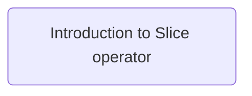

# Script Goals

- Make a video in two weeks.
- Have an organised task management system.
- Test.

| Animation Task                                                                                                                                          | Status      | Due Date   |
| ------------------------------------------------------------------------------------------------------------------------------------------------------- | ----------- | ---------- |
| [[Rust Scripts/Week 3/Tasks/NotFinished/Create sketchs for Introduction to Slice operator.md\|Create sketchs for Introduction to Slice operator]]       | Not Started | 19-02-2024 |
| [[Rust Scripts/Week 3/Tasks/NotFinished/Create Animations for Introduction to Slice operator.md\|Create Animations for Introduction to Slice operator]] | Not Started | 19-02-2024 |

| Editing Task                                                                                                                      | Status      | Due Date   |
| --------------------------------------------------------------------------------------------------------------------------------- | ----------- | ---------- |
| [[Rust Scripts/Week 3/Tasks/NotFinished/Edit Introduction to Slice operator Video.md\|Edit Introduction to Slice operator Video]] | Not Started | 19-02-2024 |

| Recording Task                                                                                                                              | Status      | Due Date   |
| ------------------------------------------------------------------------------------------------------------------------------------------- | ----------- | ---------- |
| [[Rust Scripts/Week 3/Tasks/NotFinished/Record Introduction to Slice operator Video.md.md\|Record Introduction to Slice operator Video.md]] | Not Started | 19-02-2024 |

| Script Task                                                                                                                                   | Status      | Due Date   |
| --------------------------------------------------------------------------------------------------------------------------------------------- | ----------- | ---------- |
| [[Rust Scripts/Week 3/Tasks/NotFinished/Write script for Introduction to Slice operator.md\|Write script for Introduction to Slice operator]] | Not Started | 19-02-2024 |

| Finished-Task | Status | Task-Type |
| ------------- | ------ | --------- |

# Final Draft

The script: [[Introduction to Slice operator(Rust)]] is incomplete.

# Current Thoughts

## Reflections

Definitely need to reflect on mistakes.