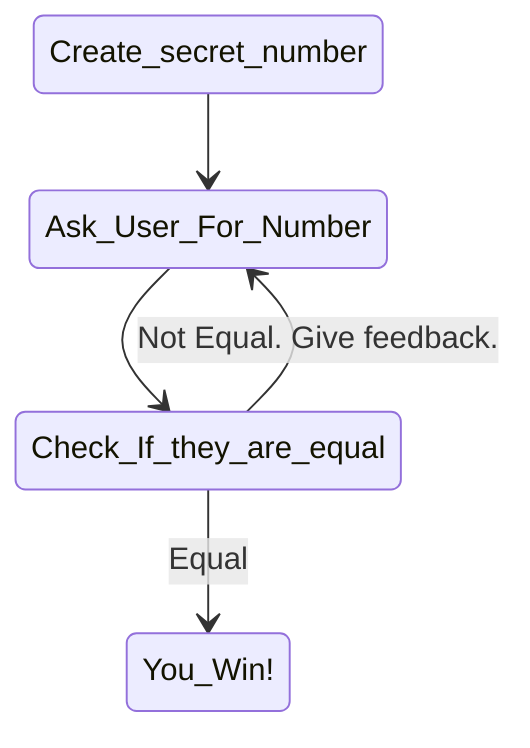

# Purpose
The goal of this project is to get the user okay with [[loop(Rust)|loops]] and reading input from the user through [[read_line(Rust)|read_line]].

## Description
The goal is to create a secret number and then get the user to guess it. The program will tell them if they are too high or too low.


# An algorithm diagram



# Things I don't understand

## :: versus .

In this code, there is part of the script where we write

```Rust
let secret_number = rand::thread_rng().gen_range(1..=100);
```
This could be my inexperience but, it feels like the :: and the dot are both accessing subfolders/ attributes but they are clearly doing things differently. I am unsure of what the difference is.

## thread_rng().gen_range()
In part of the code we say 
```Rust
let secret_number = rand::thread_rng().gen_range(1..=100);
```
This feels odd to me. I would have thought the gen_range part would be an input to thread_rng()?

## Error Checking

How does it know num? Syntax gotten for free?

```Rust
let guess: u32 = match guess.trim().parse() {
	Ok(num) => num,
	Err(_) => continue,
};
```
My first thought it to try replace num with a different word and see if it does this by the structure of the answer.

```Rust
let guess: u32 = match guess.trim().parse() {
	Ok(check) => check,
	Err(_) => continue,
};
```
This led me to question what if I have multiple things to check? do I do something like

```Rust 
match epr1,expr2 {
Ok(name1,name2) => Do what you want,
Err(_,_) => Deal with it,
}
```
## Mut Location

Changing where Mut is causes the compiler to be upset. Not sure why though?

