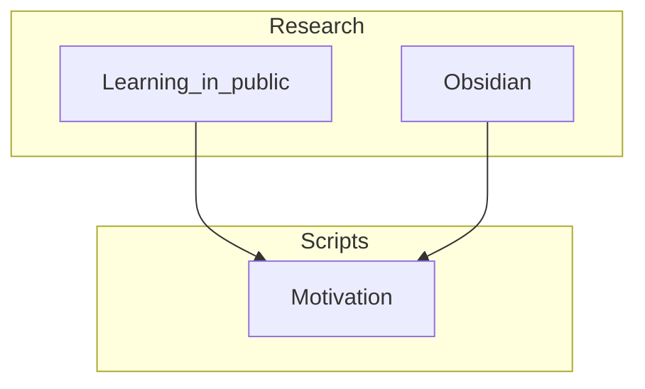

# Script Goal

The main point here is to get used to talking about what I think. I am going to talk about things I have seen before.

## Picture overview

| Research-Task | Status | Due-Date |
| ------------- | ------ | -------- |

| Script-Task                                                                                                 | Status      | Due-Date   |
| ----------------------------------------------------------------------------------------------------------- | ----------- | ---------- |
| [[Scripts/Week_1 Rust/Tasks/NotFinished/Write first script about Cargo.md\|Write first script about Cargo]] | Not Started | 2024-09-30 |
| [[Scripts/Week_1 Rust/Tasks/NotFinished/Write about guessing game.md\|Write about guessing game]]           | Not Started | 2024-09-30 |

| Recording-Task | Status | Due-Date |
| -------------- | ------ | -------- |

| Finished-Task                                                                                            | Status | Task-Type |
| -------------------------------------------------------------------------------------------------------- | ------ | --------- |
| [[Scripts/Week_1 Rust/Tasks/Complete/Write Motivation Script.md\|Write Motivation Script]]               | Done   | Script    |
| [[Scripts/Week_1 Rust/Tasks/Complete/Write first script about Rustc.md\|Write first script about Rustc]] | Done   | Script    |
